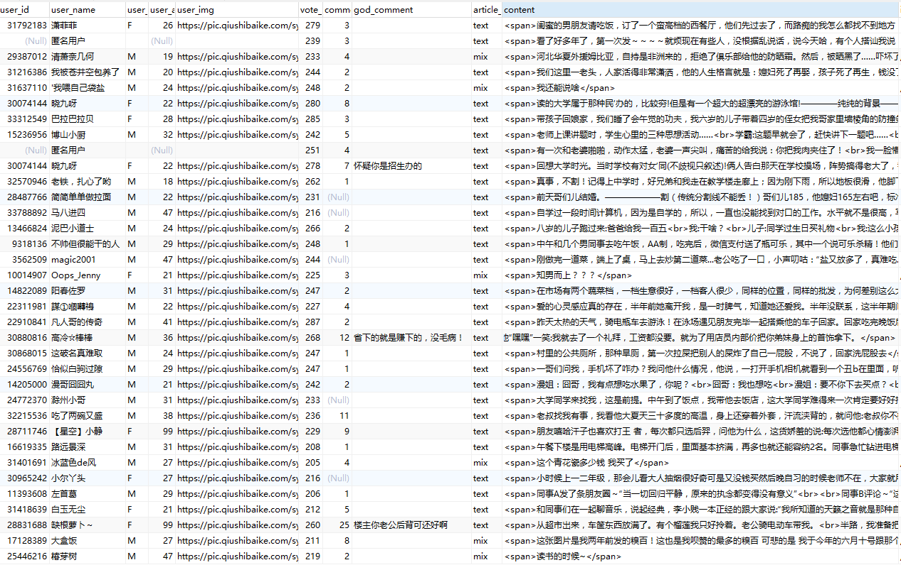

# 糗事百科爬虫
爬取糗事百科的段子, 然后进行汇总, 统计和分析  
目前功能为通过PC网页端的热门栏目进行增量爬取, 默认循环间隔为1小时  
  
Author: William Yang  
Version: 0.1.2  
Date: 2017/07/13

## 说明
 * 基于Python3
 * 使用Scrapy爬虫框架
 * 使用Pony ORM框架
 * 可以使用MySQL保存数据
 * 默认采取命令行方式输出
 
 ## 使用方法
 1. crawl_entrance.py文件为爬虫入口, 唯一参数为spider的名字, 此处为article,  
 这是为了方便使用PyCharm的朋友作为入口的, 只需要在PyCharm设置好由该文件启动即可,  
 另外也可以直接命令行运行该文件
 2. 设置settings.py的MYSQL_CONFIG中的参数, 并预先创建好数据库, 不需要创建具体数据表,  
 Pony ORM会自动创建, 如果不想用数据库, 可以在settings.py中的ITEM_PIPELINES里屏蔽
 3. 设置好settings.py的CRAWL_INTERVAL和CRAWL_CYCLES
##### 最后, 运行crawl_entrance.py即可开始爬取, 下面为部分数据截图

